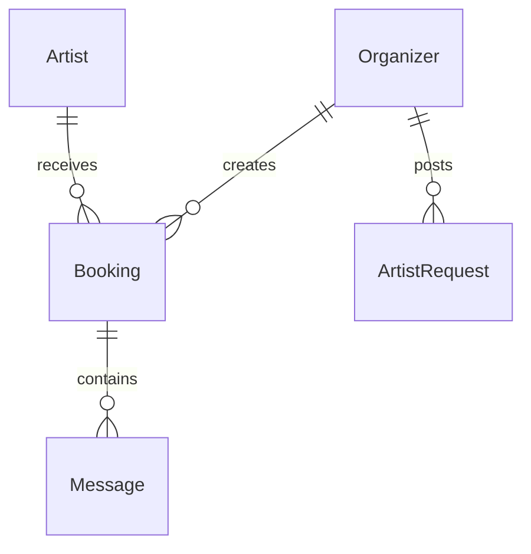
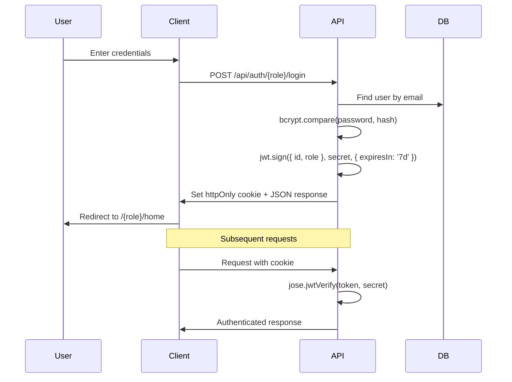

<p align="center">
  
  
  
  
  
  
  
  
  
</p>

# 🎨 ArtistBridge

> **India's Premium AI-Powered Talent Marketplace** — Discover, book, and manage world-class artists for events, powered by RAG-based AI matching, LangGraph agents, and real-time messaging.

<p align="center">
  <a href="https://artist-bridge-6gyb3azqj-rohanb1022s-projects.vercel.app/">🌐 Live Demo</a> ·
  <a href="#-features">Features</a> ·
  <a href="#-ai--rag-architecture">AI Architecture</a> ·
  <a href="#%EF%B8%8F-tech-stack">Tech Stack</a> ·
  <a href="#-getting-started">Getting Started</a> ·
  <a href="#-api-reference">API Reference</a>
</p>

---


---

## 📋 Table of Contents

- [Overview](#-overview)
- [Features](#-features)
- [AI & RAG Architecture](#-ai--rag-architecture)
- [Tech Stack](#%EF%B8%8F-tech-stack)
- [Database Schema](#-database-schema)
- [Project Structure](#-project-structure)
- [Getting Started](#-getting-started)
- [Environment Variables](#-environment-variables)
- [API Reference](#-api-reference)
- [Authentication & Security](#-authentication--security)
- [Design System](#-design-system)
- [Screenshots](#-screenshots)
- [Deployment](#-deployment)
- [Future Roadmap](#-future-roadmap)
- [Contributing](#-contributing)
- [License](#-license)
- [Author](#-author)

---

## 🌟 Overview

**ArtistBridge** is a production-grade, full-stack web application built with **Next.js 15 (App Router)** that bridges the gap between **event organizers** and **performing artists** across India. The platform features:

- **Dual-role authentication** (Artist & Organizer) with JWT-based session management
- **AI-Powered Artist Discovery** using Pinecone vector search (RAG) + Groq Llama 3
- **Autonomous AI Agents** built with LangGraph for both organizers and artists
- **Real-time booking-scoped messaging** with AI content moderation
- **Complete booking lifecycle management** — from request to confirmation/cancellation
- **Minimalist, premium UI** inspired by Stripe/Linear design language

The platform supports **15 artist categories** — Singers, Dancers, DJs, Magicians, Comedians, Instrumentalists, Mime Artists, Theatre Performers, Beatboxers, Speakers, Painters, Poets, Photographers, Models, and Circus Performers — across **50+ Indian cities**.

---

## ✨ Features

### 🎭 For Artists

| Feature | Description |
|---------|-------------|
| **Secure Authentication** | Signup/login with bcrypt password hashing and JWT cookie-based sessions (7-day expiry) |
| **Profile Management** | Complete profile with bio, categories (multi-select), city, base pricing, and best event highlight |
| **Personal Landing Page** | Auto-generated public profile page with DiceBear avatar, social links, bio, and a contact form |
| **Booking Dashboard** | View all confirmed bookings with event details (name, date, time, city, organizer) |
| **Pending Request Management** | Accept or reject incoming booking requests from organizers with real-time status updates |
| **Open Request Discovery** | Browse public artist requests posted by organizers and accept matching opportunities |
| **Booking-Scoped Chat** | Real-time messaging with organizers for confirmed bookings (polling-based, 3s interval) |
| **AI Career Manager** | LangGraph-powered AI agent that reviews pending bookings, drafts professional replies, and provides scheduling/negotiation advice |

### 🏢 For Organizers

| Feature | Description |
|---------|-------------|
| **Secure Authentication** | Separate signup/login flow with role-based access control |
| **Artist Marketplace** | Browse all verified artists with live search filtering by name, city, or category |
| **Detailed Artist Profiles** | View artist bio, categories, city, pricing, and highlight performance before booking |
| **Direct Booking Requests** | Send booking requests with event name, date, time, city, price, and category — validates future dates |
| **Custom Artist Requests** | Post public requests specifying category, city, max budget, date, and timing for artists to discover |
| **Booking Manager** | Tabbed dashboard (Pending / Confirmed / Cancelled) with cancel and chat actions for confirmed bookings |
| **Booking-Scoped Chat** | Direct messaging with booked artists within confirmed booking context |
| **AI Event Assistant** | RAG-powered conversational AI that searches the artist database semantically, checks availability, and can create bookings — all through natural language |
| **Sent Requests Tracker** | Monitor the status (PENDING / MATCHED) of all custom artist requests |

### 🔒 Shared / Platform-wide

| Feature | Description |
|---------|-------------|
| **Role-Based Middleware** | Next.js Edge Middleware prevents cross-role access (artists can't access organizer routes and vice versa) |
| **Cookie-Based JWT Sessions** | httpOnly, secure, sameSite-strict cookies with automatic redirect for authenticated users on auth pages |
| **AI Content Moderation** | All chat messages pass through a HuggingFace toxic comment classifier before persistence |
| **Responsive Design** | Fully optimized for mobile, tablet, and desktop with responsive navigation (hamburger menu on mobile) |
| **Smooth Scrolling** | Lenis smooth-scroll integration for buttery page transitions |
| **Animated UI** | Framer Motion animations throughout — hero reveals, staggered card grids, marquee categories, and chat transitions |
| **SEO Optimized** | Open Graph metadata, semantic HTML, and proper heading hierarchy |
| **Toast Notifications** | react-toastify integration for booking actions, errors, and logout confirmations |

---

## 🧠 AI & RAG Architecture

ArtistBridge implements a sophisticated **multi-agent AI system** combining RAG (Retrieval-Augmented Generation) with LangGraph autonomous agents.

### Architecture Overview

```
┌─────────────────────────────────────────────────────────────────┐
│                        CLIENT (Next.js)                         │
│  ┌──────────────────┐           ┌──────────────────────────┐   │
│  │  AI Event        │           │  AI Career               │   │
│  │  Assistant (Org)  │           │  Manager (Artist)        │   │
│  └────────┬─────────┘           └────────────┬─────────────┘   │
└───────────┼──────────────────────────────────┼─────────────────┘
            │ POST /api/ai/agent               │ POST /api/artist/ai-manager
            ▼                                  ▼
┌───────────────────────┐      ┌───────────────────────────────┐
│  Organizer Agent      │      │  Artist Agent                 │
│  (LangGraph)          │      │  (LangGraph)                  │
│                       │      │                               │
│  Tools:               │      │  Tools:                       │
│  ├─ search_artists    │      │  └─ get_pending_bookings      │
│  ├─ check_availability│      │                               │
│  └─ create_booking    │      │  Capabilities:                │
│                       │      │  ├─ Review pending requests   │
│  Model: Llama 3.1 8B  │      │  ├─ Draft replies             │
│  via Groq             │      │  └─ Scheduling advice         │
└───────────┬───────────┘      └───────────────────────────────┘
            │
            ▼
┌──────────────────────────────────────────────────────────┐
│                    RAG PIPELINE                           │
│                                                          │
│  ┌─────────────┐    ┌───────────────┐    ┌────────────┐ │
│  │ HuggingFace │───▶│   Pinecone    │───▶│  MongoDB   │ │
│  │ Embeddings  │    │  Vector DB    │    │  (Prisma)  │ │
│  │ MiniLM-L6   │    │  384-dim      │    │            │ │
│  │ (384-dim)   │    │  Top-K search │    │  Filtered  │ │
│  └─────────────┘    └───────────────┘    │  Results   │ │
│                                          └────────────┘ │
└──────────────────────────────────────────────────────────┘
```

### Component Details

#### 1. Vector Sync Pipeline (`/api/ai/sync`)
- Fetches all artists with completed profiles from MongoDB
- Generates rich text representations (name, category, city, price, bio, best event)
- Creates 384-dimensional embeddings using `sentence-transformers/all-MiniLM-L6-v2` via HuggingFace Inference API
- Upserts vectors with metadata to the `artistbridge` Pinecone index

#### 2. RAG Chat (`/api/ai/chat`)
- Embeds the user's natural language query
- Queries Pinecone for top-3 semantically similar artist profiles
- Constructs a grounded prompt with retrieved context
- Generates a response via Groq (Llama 3.1 8B) with strict hallucination prevention
- Returns both the AI text response and structured artist data for UI card rendering

#### 3. Organizer Agent (LangGraph — `/api/ai/agent`)
- **StateGraph** architecture with `agent` → `tools` → `agent` loop
- Three bound tools:
  - `search_artists` — Semantic + filtered database search (category, city, maxPrice)
  - `check_artist_availability` — Queries booking conflicts for a given artist + date
  - `create_booking_request` — Creates a booking (requires explicit user confirmation)
- Automatic **database fallback** on Groq rate limits / API failures — parses natural language for categories, cities, and prices, then queries MongoDB directly
- Injects organizer ID from JWT context for authenticated bookings

#### 4. Artist Agent (LangGraph — `/api/artist/ai-manager`)
- Single tool: `get_pending_bookings` — Retrieves all pending booking requests
- System prompt designed for career management: encouragement, negotiation drafting, scheduling advice
- Same StateGraph pattern with conditional tool routing

#### 5. Content Moderation (`lib/ai/moderation.ts`)
- Uses HuggingFace `martin-ha/toxic-comment-model` for toxicity classification
- Threshold: messages scoring > 0.7 toxicity are blocked
- Graceful fallback: allows messages through if the moderation API fails (no user blocking on external failures)

---

## 🛠️ Tech Stack

### Core Framework
| Technology | Version | Purpose |
|------------|---------|---------|
| [Next.js](https://nextjs.org/) | 15.3.8 | Full-stack React framework (App Router, API Routes, Middleware) |
| [React](https://react.dev/) | 19.x | UI library |
| [TypeScript](https://www.typescriptlang.org/) | 5.x | Type safety |
| [Turbopack](https://turbo.build/) | — | Dev server bundler (`next dev --turbopack`) |

### Database & ORM
| Technology | Purpose |
|------------|---------|
| [MongoDB Atlas](https://www.mongodb.com/atlas) | Cloud-hosted NoSQL database |
| [Prisma ORM](https://www.prisma.io/) | 6.x — Type-safe database access with auto-generated client |

### AI / ML Pipeline
| Technology | Purpose |
|------------|---------|
| [LangChain](https://js.langchain.com/) + [LangGraph](https://langchain-ai.github.io/langgraphjs/) | Multi-step AI agent orchestration with tool binding |
| [Groq](https://groq.com/) (Llama 3.1 8B Instant) | Ultra-fast LLM inference for agent responses |
| [Pinecone](https://www.pinecone.io/) | Serverless vector database for semantic artist search |
| [HuggingFace Inference](https://huggingface.co/inference-api) | `all-MiniLM-L6-v2` embeddings (384-dim) + `toxic-comment-model` moderation |

### Authentication & Security
| Technology | Purpose |
|------------|---------|
| [jsonwebtoken](https://github.com/auth0/node-jsonwebtoken) | JWT token generation |
| [jose](https://github.com/panva/jose) | Edge-compatible JWT verification (for Next.js middleware) |
| [bcryptjs](https://github.com/dcodeIO/bcrypt.js) | Password hashing (salt rounds: 10) |

### UI / Frontend
| Technology | Purpose |
|------------|---------|
| [Tailwind CSS](https://tailwindcss.com/) | 4.x — Utility-first styling |
| [Framer Motion](https://www.framer.com/motion/) | Page transitions, scroll-triggered animations, chat animations |
| [Radix UI](https://www.radix-ui.com/) | Accessible primitives: Dialog, Dropdown Menu, Select, Navigation Menu, Label |
| [Lucide React](https://lucide.dev/) + [React Icons](https://react-icons.github.io/) | Icon library |
| [Lenis](https://lenis.darkroom.engineering/) | Smooth scroll engine |
| [Embla Carousel](https://www.embla-carousel.com/) | Carousel/slider component |
| [Recharts](https://recharts.org/) | Data visualization |
| [React Day Picker](https://react-day-picker.js.org/) | Date selection in booking forms |
| [React Hook Form](https://react-hook-form.com/) + [Zod](https://zod.dev/) | Form management with schema validation |
| [react-toastify](https://fkhadra.github.io/react-toastify/) | Toast notification system |
| [Axios](https://axios-http.com/) | HTTP client with cookie-based credential forwarding |

### Typography
| Font | Usage |
|------|-------|
| **Cormorant Garamond** (500, 600; normal + italic) | Headings — serif elegance |
| **Inter** (400, 500, 600) | Body text — clean sans-serif |

---

## 🗃 Database Schema

The application uses **MongoDB** via **Prisma ORM**. Below is the complete data model:

```prisma
model Artist {
  id          String     @id @default(auto()) @map("_id") @db.ObjectId
  email       String     @unique
  name        String
  city        String?
  password    String
  category    String[]        // Multi-select: ["SINGER", "DANCER", ...]
  bestEvent   String?         // Highlight performance description
  price       Int?            // Base price in INR
  bio         String?
  created_at  DateTime   @default(now())
  updated_at  DateTime   @updatedAt
  bookings    Booking[]
}

model Organizer {
  id              String           @id @default(auto()) @map("_id") @db.ObjectId
  email           String           @unique
  name            String
  password        String
  artistRequests  ArtistRequest[]
  bookings        Booking[]
}

model Booking {
  id             String        @id @default(auto()) @map("_id") @db.ObjectId
  artistId       String        @db.ObjectId
  organizerId    String        @db.ObjectId
  artistName     String
  organizerName  String
  eventName      String
  date           String
  time           String
  status         BookingStatus  @default(PENDING)    // PENDING | CONFIRMED | CANCELLED | REJECTED
  city           String
  price          Int
  category       String
  artist         Artist        @relation(...)
  organizer      Organizer     @relation(...)
  messages       Message[]
}

model Message {
  id          String    @id @default(auto()) @map("_id") @db.ObjectId
  bookingId   String    @db.ObjectId
  senderId    String    @db.ObjectId
  senderRole  String         // "artist" | "organizer"
  senderName  String
  content     String         // Moderated via HuggingFace before storage
  createdAt   DateTime  @default(now())
  booking     Booking   @relation(...)
}

model ArtistRequest {
  id           String         @id @default(auto()) @map("_id") @db.ObjectId
  organizerId  String         @db.ObjectId
  email        String
  name         String
  city         String
  category     String
  maxBudget    Int
  date         String
  timing       String
  status       RequestStatus  @default(PENDING)    // PENDING | MATCHED
  createdAt    DateTime       @default(now())
  organizer    Organizer      @relation(...)
}
```

### Enums

| Enum | Values |
|------|--------|
| `BookingStatus` | `PENDING`, `CONFIRMED`, `CANCELLED`, `REJECTED` |
| `RequestStatus` | `PENDING`, `MATCHED` |
| `ArtistCategory` | `SINGER`, `DANCER`, `MAGICIAN`, `COMEDIAN`, `DJ`, `INSTRUMENTALIST`, `MIME`, `THEATRE`, `BEATBOXER`, `SPEAKER`, `PAINTER`, `POET`, `PHOTOGRAPHER`, `MODEL`, `CIRCUS` |

### Entity Relationships



---

## 📁 Project Structure

```
ArtistBridge/
├── app/
│   ├── api/                          # ─── Backend API Routes ───
│   │   ├── ai/
│   │   │   ├── agent/route.ts        # LangGraph organizer agent (search + book)
│   │   │   ├── chat/route.ts         # RAG chat endpoint (Pinecone + Groq)
│   │   │   └── sync/route.ts         # Sync artist profiles → Pinecone vectors
│   │   ├── artist/
│   │   │   ├── acceptRequest/        # Accept/reject booking (PATCH)
│   │   │   ├── ai-manager/           # LangGraph artist career manager
│   │   │   ├── completeProfile/      # Update artist profile details
│   │   │   ├── getAllBookings/        # Fetch artist's bookings (grouped by status)
│   │   │   ├── getProfile/           # Get authenticated artist's profile
│   │   │   ├── getRequest/           # Fetch open artist requests
│   │   │   ├── recommendEvents/      # Event recommendations for artists
│   │   │   └── searchArtist/         # Search artists (server-side)
│   │   ├── auth/
│   │   │   ├── artist/login/         # Artist login (bcrypt + JWT)
│   │   │   ├── artist/signup/        # Artist registration
│   │   │   ├── organizer/login/      # Organizer login
│   │   │   ├── organizer/signup/     # Organizer registration
│   │   │   └── logout/               # Clear auth cookie
│   │   ├── booking/
│   │   │   ├── bookingAccept/        # Confirm a booking
│   │   │   ├── bookingRejection/     # Reject/cancel a booking
│   │   │   ├── bookingRequest/       # Create new booking request
│   │   │   └── cancelBooking/        # Cancel confirmed booking
│   │   ├── chat/
│   │   │   ├── getMessages/          # Fetch messages for a booking
│   │   │   └── sendMessage/          # Send message (with AI moderation)
│   │   └── organizer/
│   │       ├── artist-profile/[id]/  # Get individual artist profile
│   │       ├── getAllArtists/         # List all artists
│   │       ├── getAllBookings/        # Organizer's bookings (grouped)
│   │       ├── getAllRequests/        # Organizer's sent requests
│   │       ├── recommendArtists/     # AI-based artist recommendations
│   │       └── sendRequest/          # Post a custom artist request
│   │
│   ├── artist/                       # ─── Artist Pages ───
│   │   ├── ai-manager/page.tsx       # AI Career Manager chat interface
│   │   ├── artistdetails/page.tsx    # Complete/edit profile form
│   │   ├── bookings/page.tsx         # View all bookings (tabbed)
│   │   ├── chat/[bookingId]/page.tsx # Real-time chat with organizer
│   │   ├── home/page.tsx             # Artist dashboard
│   │   ├── pending/page.tsx          # Pending booking requests
│   │   ├── profile/page.tsx          # Personal landing page preview
│   │   └── requests/page.tsx         # Browse open organizer requests
│   │
│   ├── auth/                         # ─── Auth Pages ───
│   │   ├── artist/login/page.tsx
│   │   ├── artist/signup/page.tsx
│   │   ├── organizer/login/page.tsx
│   │   └── organizer/signup/page.tsx
│   │
│   ├── organizer/                    # ─── Organizer Pages ───
│   │   ├── ai-assistant/page.tsx     # AI Event Assistant (RAG chat)
│   │   ├── artist-profile/[id]/      # View artist's detailed profile
│   │   ├── bookArtist/[id]/          # Booking form for specific artist
│   │   ├── booking-request/[id]/     # Booking request details
│   │   ├── chat/[bookingId]/         # Real-time chat with artist
│   │   ├── explore/page.tsx          # Browse all artists marketplace
│   │   ├── get-request/page.tsx      # Track sent custom requests
│   │   ├── home/page.tsx             # Organizer dashboard
│   │   ├── manage-bookings/page.tsx  # Tabbed booking manager
│   │   ├── org-request/page.tsx      # Post custom artist request form
│   │   └── searchfilters/page.tsx    # Advanced artist search
│   │
│   ├── globals.css                   # Design system & utility classes
│   ├── layout.tsx                    # Root layout (fonts, metadata, SmoothScroll)
│   └── page.tsx                      # Public landing page
│
├── components/
│   ├── AnimatedBackground.jsx        # Background visual effects
│   ├── Navbar.tsx                    # Global navigation bar
│   ├── SmoothScroll.tsx              # Lenis smooth scroll wrapper
│   ├── artist-profile.tsx            # Organizer's view of artist profile
│   ├── personal-landing.tsx          # Artist's personal landing page
│   └── ui/                           # Radix-based UI primitives
│       ├── badge.tsx
│       ├── button.tsx
│       ├── calendar.tsx
│       ├── card.tsx
│       ├── drawer.tsx
│       ├── dropdown-menu.tsx
│       ├── input.tsx
│       ├── label.tsx
│       ├── navigation-menu.tsx
│       ├── select.tsx
│       └── textarea.tsx
│
├── constants/
│   ├── artist.ts                     # Demo artists, categories, artist types
│   └── organizationlist.ts           # Demo organizers, reviews
│
├── lib/
│   ├── agents/
│   │   ├── artistAgent.ts            # LangGraph artist career manager agent
│   │   ├── organizerAgent.ts         # LangGraph organizer booking agent
│   │   └── tools.ts                  # LangChain tools (search, availability, booking)
│   ├── ai/
│   │   └── moderation.ts             # HuggingFace toxicity moderation
│   ├── auth/
│   │   ├── auth.ts                   # JWT generation (jsonwebtoken) + verification (jose)
│   │   └── cookie.ts                 # httpOnly cookie management
│   ├── axios.ts                      # Axios instance with cookie credentials
│   ├── middleware.ts                  # withAuth — server-side auth helper
│   ├── prisma.ts                     # Prisma client singleton
│   └── utils.ts                      # cn() utility (clsx + tailwind-merge)
│
├── sections/
│   ├── artists/                      # Landing page sections for artist portal
│   │   ├── ArtistCTA.tsx
│   │   ├── FamousArtist.tsx
│   │   ├── Footer.tsx
│   │   ├── Hero.tsx
│   │   └── OrgDemo.tsx
│   └── organizer/                    # Landing page sections for organizer portal
│       ├── ArtistDemo.tsx
│       ├── Footer.tsx
│       ├── Hero.tsx                  # Organizer dashboard hero with AI banner
│       ├── OrgCTA.tsx
│       └── Testimonials.tsx
│
├── types/
│   └── index.d.ts                    # TypeScript interfaces (Artist, ArtistCategory, DecodedUser, Role)
│
├── prisma/
│   ├── schema.prisma                 # Complete database schema
│   └── migrations/                   # Migration history
│
├── middleware.ts                     # Next.js Edge Middleware (route protection)
├── next.config.ts                    # Next.js configuration
├── tailwind.config.ts
├── tsconfig.json
├── postcss.config.mjs
├── components.json                   # shadcn/ui configuration
└── package.json
```

---

## 🚀 Getting Started

### Prerequisites

- **Node.js** ≥ 18.x
- **npm** or **yarn**
- **MongoDB Atlas** cluster (free tier works)
- **API Keys**: Pinecone, Groq, HuggingFace (free tiers available)

### Installation

```bash
# 1. Clone the repository
git clone https://github.com/rohanb1022/ArtistBridge.git
cd ArtistBridge

# 2. Install dependencies
npm install

# 3. Set up environment variables
cp .env.example .env
# Edit .env with your credentials (see Environment Variables section)

# 4. Generate Prisma client
npx prisma generate

# 5. Push schema to database (or run migrations)
npx prisma db push

# 6. (Optional) Sync artist data to Pinecone
# After creating some artist profiles, call:
# POST http://localhost:3000/api/ai/sync

# 7. Start the development server
npm run dev
```

The app will be running at **http://localhost:3000**.

---

## 🔐 Environment Variables

Create a `.env` file in the project root with the following variables:

```env
# ─── Database ───
DATABASE_URL="mongodb+srv://<username>:<password>@<cluster>.mongodb.net/<dbname>?retryWrites=true&w=majority"

# ─── Authentication ───
JWT_SECRET_KEY="your-strong-secret-key-here"
JWT_EXPIRES_IN="3d"

# ─── API Base URL ───
NEXT_PUBLIC_API_URL="/app/api"

# ─── AI & RAG Configuration ───
PINECONE_API_KEY="your-pinecone-api-key"
PINECONE_INDEX_NAME="artistbridge"
GROQ_API_KEY="your-groq-api-key"
HUGGINGFACE_API_KEY="your-huggingface-api-key"
```

| Variable | Required | Description |
|----------|----------|-------------|
| `DATABASE_URL` | ✅ | MongoDB Atlas connection string |
| `JWT_SECRET_KEY` | ✅ | Secret for JWT token signing |
| `JWT_EXPIRES_IN` | ✅ | Token expiration duration (e.g., `3d`, `7d`) |
| `PINECONE_API_KEY` | ⚡ | Required for AI features |
| `PINECONE_INDEX_NAME` | ⚡ | Pinecone index name (default: `artistbridge`) |
| `GROQ_API_KEY` | ⚡ | Required for AI agent responses |
| `HUGGINGFACE_API_KEY` | ⚡ | Required for embeddings & content moderation |

> **Note:** The app functions without AI keys — AI features will gracefully degrade. Core booking/auth features work independently.

---

## 📡 API Reference

### Authentication

| Method | Endpoint | Description | Auth |
|--------|----------|-------------|------|
| `POST` | `/api/auth/artist/signup` | Register a new artist | ❌ |
| `POST` | `/api/auth/artist/login` | Artist login | ❌ |
| `POST` | `/api/auth/organizer/signup` | Register a new organizer | ❌ |
| `POST` | `/api/auth/organizer/login` | Organizer login | ❌ |
| `POST` | `/api/auth/logout` | Clear auth cookie | ❌ |

### Artist APIs

| Method | Endpoint | Description | Auth |
|--------|----------|-------------|------|
| `GET` | `/api/artist/getProfile` | Get authenticated artist's profile | 🔒 Artist |
| `POST` | `/api/artist/completeProfile` | Update profile (bio, categories, price) | 🔒 Artist |
| `GET` | `/api/artist/getAllBookings` | Get artist's bookings (grouped by status) | 🔒 Artist |
| `PATCH` | `/api/artist/acceptRequest` | Accept or reject a booking request | 🔒 Artist |
| `GET` | `/api/artist/getRequest` | Browse open organizer requests | 🔒 Artist |
| `GET` | `/api/artist/recommendEvents` | Get AI-recommended events | 🔒 Artist |
| `GET` | `/api/artist/searchArtist` | Search artists | 🔒 Artist |
| `POST` | `/api/artist/ai-manager` | Chat with AI Career Manager | 🔒 Artist |

### Organizer APIs

| Method | Endpoint | Description | Auth |
|--------|----------|-------------|------|
| `GET` | `/api/organizer/getAllArtists` | List all artists | 🔒 Organizer |
| `GET` | `/api/organizer/artist-profile/:id` | Get specific artist's profile | 🔒 Organizer |
| `GET` | `/api/organizer/getAllBookings` | Get organizer's bookings (grouped) | 🔒 Organizer |
| `GET` | `/api/organizer/getAllRequests` | Get all sent custom requests | 🔒 Organizer |
| `POST` | `/api/organizer/sendRequest` | Post a custom artist request | 🔒 Organizer |
| `GET` | `/api/organizer/recommendArtists` | Get AI-recommended artists | 🔒 Organizer |

### Booking APIs

| Method | Endpoint | Description | Auth |
|--------|----------|-------------|------|
| `POST` | `/api/booking/bookingRequest` | Create a new booking request | 🔒 Organizer |
| `PUT` | `/api/booking/bookingAccept` | Confirm a booking | 🔒 Artist |
| `PUT` | `/api/booking/bookingRejection` | Reject or cancel a booking | 🔒 Both |
| `DELETE` | `/api/booking/cancelBooking` | Cancel a booking | 🔒 Both |

### Chat APIs

| Method | Endpoint | Description | Auth |
|--------|----------|-------------|------|
| `GET` | `/api/chat/getMessages?bookingId=<id>` | Get all messages for a booking | 🔒 Both |
| `POST` | `/api/chat/sendMessage` | Send a moderated message | 🔒 Both |

### AI APIs

| Method | Endpoint | Description | Auth |
|--------|----------|-------------|------|
| `POST` | `/api/ai/agent` | Organizer AI agent (LangGraph) | 🔒 Organizer |
| `POST` | `/api/ai/chat` | RAG-based artist search chat | 🔒 Organizer |
| `POST` | `/api/ai/sync` | Sync artist profiles to Pinecone | ❌ (Admin) |

---

## 🔐 Authentication & Security

### Auth Flow



### Security Features

| Layer | Implementation |
|-------|---------------|
| **Password Storage** | bcrypt with 10 salt rounds |
| **Token Generation** | `jsonwebtoken` for creating JWTs |
| **Token Verification** | `jose` (Edge-compatible) for middleware verification |
| **Cookie Security** | `httpOnly`, `secure` (production), `sameSite: strict`, 7-day max-age |
| **Route Protection** | Next.js Edge Middleware intercepts `/artist/*` and `/organizer/*` routes |
| **Cross-Role Prevention** | Artists can't access `/organizer/*` routes and vice versa |
| **Auth Page Redirect** | Authenticated users are redirected away from `/auth/*` pages |
| **Server-Side Auth** | `withAuth()` helper extracts and verifies JWT from cookies in API routes |
| **Content Moderation** | HuggingFace toxicity classifier blocks harmful messages (threshold: 0.7) |
| **Input Validation** | Zod schema validation + manual field checks in API routes |
| **Future Date Validation** | Booking dates/times validated to be in the future |

---

## 🎨 Design System

The UI follows a **minimalist light aesthetic** inspired by **Stripe**, **Linear**, and **BackdoorAI**.

### Color Palette

| Token | Hex | Usage |
|-------|-----|-------|
| `--background` | `#FFFFFF` | Page background |
| `--foreground` | `#111111` | Primary text |
| `--primary` | `#111111` | Buttons, links, emphasis |
| `--muted` | `#F8F8F8` | Secondary backgrounds |
| `--muted-foreground` | `#666666` | Secondary text |
| `--border` | `#E5E5E5` | Borders, dividers |
| `--destructive` | `#EF4444` | Error states |

### Component Classes

| Class | Purpose |
|-------|---------|
| `.btn-gold` | Primary dark button with subtle hover lift |
| `.btn-violet` | Secondary white button with border |
| `.glass-card` | Clean card with hover border transition |
| `.studio-input` | Premium input field with focus ring |
| `.badge-confirmed` | Green status badge |
| `.badge-pending` | Amber status badge |
| `.badge-cancelled` | Red status badge |
| `.badge-matched` | Blue status badge |
| `.shimmer` | Loading skeleton animation |

---

## 📸 Screenshots

### Artist Home Dashboard


### Organizer Home Dashboard


### Features


---

## 🌐 Deployment

The application is deployed on **Vercel** with the following configuration:

```bash
# Build command
next build

# Output directory (auto-detected)
.next

# Environment variables
# Set all .env variables in Vercel Dashboard → Settings → Environment Variables
```

### Deployment Notes

- `eslint.ignoreDuringBuilds: true` and `typescript.ignoreBuildErrors: true` are enabled in `next.config.ts` for deployment flexibility
- `prisma generate` runs automatically via the `postinstall` script
- All API routes use `runtime = "nodejs"` for compatibility with Prisma and AI libraries

---

## 🗺 Future Roadmap

- [ ] **Real-time Messaging** — Replace polling with WebSockets / Supabase Realtime
- [ ] **Email Notifications** — Booking confirmations, request alerts via SendGrid/Resend
- [ ] **In-App Notifications** — Bell icon with unread count for new bookings/messages
- [ ] **Artist Ratings & Reviews** — Post-event review system with star ratings
- [ ] **Payment Integration** — Advance booking payments via Razorpay/Stripe
- [ ] **Media Portfolio** — YouTube/Instagram integration and video uploads for artist profiles
- [ ] **Calendar Sync** — Google Calendar integration for booking schedules
- [ ] **Admin Dashboard** — Platform analytics, user management, content moderation logs
- [ ] **PWA Support** — Offline capability and push notifications

---

## 🤝 Contributing

Contributions are welcome! Please follow these steps:

1. **Fork** the repository
2. **Create** a feature branch (`git checkout -b feature/amazing-feature`)
3. **Commit** your changes (`git commit -m 'feat: add amazing feature'`)
4. **Push** to the branch (`git push origin feature/amazing-feature`)
5. **Open** a Pull Request

### Commit Convention

This project follows [Conventional Commits](https://www.conventionalcommits.org/):
- `feat:` — New feature
- `fix:` — Bug fix
- `docs:` — Documentation changes
- `refactor:` — Code refactoring
- `style:` — Formatting, missing semicolons, etc.
- `test:` — Adding or updating tests

---

## 📜 License

This project is licensed under the [MIT License](LICENSE).

---

## 🧑‍💻 Author

<table>
  <tr>
    <td align="center">
      <strong>Rohan Bhangale</strong><br/>
      VESIT, Mumbai<br/>
      <a href="mailto:rohanbhangale25@gmail.com">📧 rohanbhangale25@gmail.com</a><br/>
      <a href="https://github.com/rohanb1022">GitHub</a>
    </td>
  </tr>
</table>

---

<p align="center">
  <sub>Built with ❤️ using Next.js, LangGraph, Pinecone, and Groq</sub>
</p>
